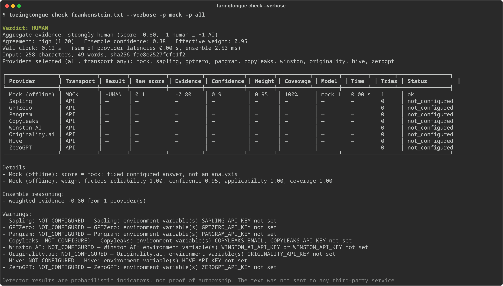

# TuringTongue

[](https://github.com/marcelpetrick/TuringTongue/actions/workflows/ci.yml)
[](https://github.com/marcelpetrick/TuringTongue/actions/workflows/docker.yml)
[](https://github.com/marcelpetrick/TuringTongue/actions/workflows/release.yml)
[](https://github.com/marcelpetrick/TuringTongue/releases/latest)
[](LICENSE)
[](https://www.python.org/)
[](localPipeline.sh)
[](pyproject.toml)
[](https://github.com/marcelpetrick/TuringTongue/pkgs/container/turingtongue)

A local Python library and CLI that sends a text — **unchanged** — to several existing
AI-text detection services, normalizes their incompatible answers, and combines them
with a transparent weighted mixture-of-experts into one short answer:

```text
HUMAN
```

`AI`, or — when it cannot responsibly decide — `NO_VERDICT`. Verbose and JSON modes show
every provider attempt, score, confidence, weight, latency, cost and failure behind it.

**Author: Marcel Petrick <mail@marcelpetrick.it>**

**License: GPLv3 or later. See [`LICENSE`](LICENSE).**

**Note: project is generated with AI.**



*Real output of `turingtongue check --verbose -p mock -p all` in an environment without
API keys: the offline mock provider answers (it is a fixed test double, not a detector),
and every real provider is reported as `not_configured` instead of being silently dropped.*

## Quick start — try it in two minutes

```bash
git clone https://github.com/marcelpetrick/TuringTongue.git && cd TuringTongue
uv sync                                    # installs Python deps from uv.lock

# 1) offline smoke test, no account needed (the mock is a fixed test double, NOT a detector)
uv run turingtongue check --text "Any text you like." -p mock          # → HUMAN
uv run turingtongue check --text "Any text you like." -p mock -v       # full report

# 2) a real check: get a free trial key at https://sapling.ai (real results, ~50k chars/day)
export SAPLING_API_KEY=your-key            # or put it into .env (see .env.example)
uv run turingtongue check benchmark/corpus/human/frankenstein.txt -v   # known human text
uv run turingtongue check benchmark/corpus/ai/claude-blog.txt -v       # known AI text
uv run turingtongue check my-essay.txt                                 # your own file → one word
```

The same without cloning, via Docker:

```bash
docker run --rm ghcr.io/marcelpetrick/turingtongue check --text "Any text." -p mock
docker run --rm -i -e SAPLING_API_KEY ghcr.io/marcelpetrick/turingtongue check - < my-essay.txt
```

Add more keys (GPTZero, Pangram, …) and the ensemble uses every configured provider
automatically; `uv run turingtongue providers` shows which are set up.

## What it does — and what it does not prove

- Asks up to eight detector APIs: **Sapling, GPTZero, Pangram, Copyleaks, Winston AI,
  Originality.ai, Hive, ZeroGPT** (see the verified [provider matrix](docs/providers.md)).
- Normalizes every answer onto one axis (−1 human … +1 AI), weighs it by confidence,
  input coverage and applicability, and reports **provider confidence, ensemble strength
  and cross-provider agreement as separate numbers** ([ADR 0002](docs/adr/0002-ensemble-v0.md)).
- Returns partial results when some providers fail; `NO_VERDICT` plus structured errors
  when none produce usable evidence or when they contradict each other.

> ⚠️ **An indicator, not proof.** Detector results — including this ensemble's — are
> probabilistic and can be wrong in both directions, especially for short, formulaic,
> technical, translated, heavily edited, mixed or non-native writing. Never use them as
> the sole basis for an accusation. Background: [human-vs-AI signals](docs/human-vs-ai-signals.md).

## Where your text goes

> 🔒 **Every selected provider receives your full text** (or an exact prefix when its
> documented size limit forces one, which is then flagged). Their own retention and
> training policies apply. The package itself never writes your text to disk or logs it.
> Details: [docs/privacy.md](docs/privacy.md).

## Install

Requires CPython **3.14+**.

```bash
git clone https://github.com/marcelpetrick/TuringTongue.git
cd TuringTongue
uv sync                      # dev environment from uv.lock
uv run turingtongue --help
# or install the wheel from a GitHub Release:
pip install turingtongue-<version>-py3-none-any.whl
# optional browser-automation framework (no site adapters ship, see ADR 0003):
pip install 'turingtongue[browser]'
```

Docker (published to GHCR by CI):

```bash
docker run --rm -e SAPLING_API_KEY -e GPTZERO_API_KEY \
  ghcr.io/marcelpetrick/turingtongue check --text "Text to check" -v
docker run --rm -i -e SAPLING_API_KEY ghcr.io/marcelpetrick/turingtongue check - < article.txt
```

## Configure provider credentials

Credentials come **only** from environment variables (a local, gitignored `.env` works
too; copy [`.env.example`](.env.example)). Providers without credentials are simply
skipped in the default selection.

| Provider | Environment variable(s) |
| --- | --- |
| Sapling | `SAPLING_API_KEY` |
| GPTZero | `GPTZERO_API_KEY` |
| Pangram | `PANGRAM_API_KEY` |
| Copyleaks | `COPYLEAKS_EMAIL` + `COPYLEAKS_API_KEY` (`COPYLEAKS_SANDBOX=1` → mock results, excluded from the verdict) |
| Winston AI | `WINSTON_AI_API_KEY` (or `WINSTON_API_KEY`) |
| Originality.ai | `ORIGINALITY_API_KEY` (note: accounts auto top-up credits by default) |
| Hive | `HIVE_API_KEY` |
| ZeroGPT | `ZEROGPT_API_KEY` (opt-in: `-p zerogpt`) |

`turingtongue providers` shows which are configured (never the values). Optional
non-secret settings (timeouts, concurrency, per-provider weights/options) go in
`~/.config/turingtongue/config.toml` or `$TURINGTONGUE_CONFIG`:

```toml
[defaults]
timeout_s = 30        # per provider
deadline_s = 120      # whole run
max_concurrency = 4

[providers.gptzero]
weight = 1.0
options = { multilingual = true }
```

## Usage

```bash
turingtongue check article.txt                  # → HUMAN | AI | NO_VERDICT
turingtongue check article.txt --verbose        # every provider, score, weight, timing
turingtongue check article.txt --json           # versioned JSON (schema_version 1.0)
turingtongue check article.txt -p gptzero -p pangram    # named providers
turingtongue check article.txt -p all           # every provider (unconfigured → NOT_CONFIGURED)
turingtongue check article.txt --transport api  # API/SDK providers only (browser: --transport browser)
cat article.txt | turingtongue check -          # stdin
turingtongue batch posts/ --csv results.csv --jsonl results.jsonl   # many files, sequentially
```

Exit codes: `0` HUMAN/AI verdict · `2` NO_VERDICT · `3` invalid input/config · `4` internal
error. An `AI` verdict is data, not a failure.

Python:

```python
from turingtongue import Checker

checker = Checker()  # settings from env / config file
result = checker.check(text)  # default provider set
result = checker.check(text, providers=["gptzero", "pangram"])
result = checker.check(text, transport="api")
result = checker.check(text, providers="all", verbose=True)  # keeps raw responses

print(result.verdict.display)  # HUMAN / AI / NO_VERDICT
print(result.aggregate.agreement)  # cross-provider agreement
for p in result.providers:  # per-provider evidence, latency, errors …
    print(p.provider_id, p.status, p.normalized_evidence, p.error)
print(result.to_json())
# inside asyncio: result = await checker.acheck(text)
```

## When providers fail

Failures are data. Every attempt yields a `ProviderResult`; failures carry a category
(`NOT_CONFIGURED`, `AUTHENTICATION_FAILED`, `RATE_LIMITED`, `QUOTA_EXHAUSTED`,
`TIMEOUT`, `SERVICE_UNAVAILABLE`, `SCHEMA_CHANGED`, `INPUT_TOO_SHORT`, …), the HTTP
status, attempts and latency — with secrets redacted. Transient errors (408/429/5xx,
network) are retried a bounded number of times with jittered backoff, honouring
`Retry-After`; 400/401/403 and exhausted quotas are not. One broken service never sinks
the run.

## Reproduce / benchmark

```bash
turingtongue benchmark -p mock                      # offline pipeline smoke run
turingtongue benchmark -p sapling -p gptzero --yes  # real providers (costs credits)
```

17 provenance-pinned samples (public-domain human prose, AI text from Claude, GPT and
Qwen, one mixed) → accuracy, balanced accuracy, FPR/FNR, abstention, ROC-AUC, latency
percentiles and cost per provider and for the ensemble. See
[docs/benchmarking.md](docs/benchmarking.md) and [docs/performance.md](docs/performance.md).

## Project metrics

Measured by [`scripts/metrics.py`](scripts/metrics.py); full tables in
[docs/metrics.md](docs/metrics.md).

| Metric | Value |
| --- | --- |
| Library code (src) | 3,439 lines in 41 files · 48 classes · 172 functions |
| Test code | 2,335 lines in 30 files (+166 lines JSON fixtures) · ratio 0.68 : 1 |
| Scripts / CI / docs | 814 / 270 / 1,314 lines |
| Tests | 313 (227 unit · 49 contract · 31 integration · 6 e2e) + 1 opt-in live |
| Branch coverage, combined | **98.4 %** (gate ≥ 95 %) |
| Coverage by tier alone | unit 91.0 % · contract 62.5 % · integration 62.5 % · **end-to-end 52.8 %** |
| Cyclomatic complexity | average 4.49 (radon), 163 of 217 blocks rank A; max 31 (`render_verbose`) |

End-to-end coverage is measured inside the `python -m turingtongue` child processes
(coverage.py subprocess patching), not estimated. Wheel-install and Docker end-to-end
checks run additionally in every pipeline.

## Development

```bash
./localPipeline.sh            # the full gate (CI runs exactly this)
./localPipeline.sh --fast     # format, lint, types, tests only
scripts/commit.sh "feat(x): … [T0xx]"   # bump version, run pipeline, commit, push
```

The pipeline: locked env sync → SPDX license headers → `ruff format --check` →
`ruff check` → `mypy --strict` → `shellcheck` → pytest (unit, contract, integration,
e2e, benchmark tiers) with **≥ 95 % branch coverage** → sdist/wheel build → `twine check`
→ clean-wheel-install e2e in a fresh venv → `pip-audit` → Docker build + offline smoke.
Network / paid / browser tests are opt-in markers; a separate scheduled
[provider-health workflow](.github/workflows/provider-health.yml) uses repository
secrets and never runs on pull requests. All helper scripts are documented in
[scripts/README.md](scripts/README.md).

Releases: `scripts/release.sh` tags `v<version>`; the Release workflow re-runs the gate
and publishes a GitHub Release with wheel + sdist; Docker publishes the image to GHCR.
PyPI publishing works like [lizard](https://github.com/terryyin/lizard/deployments/pypi): Trusted Publishing
(OIDC) from the `pypi` environment on every tag, switched on once the owner registers the
publisher on PyPI ([docs/releasing.md](docs/releasing.md)).

More: [architecture](docs/architecture.md) · [ADRs](docs/adr) · [AGENTS.md](AGENTS.md) ·
[plan.md](plan.md) · [vision.md](vision.md)
